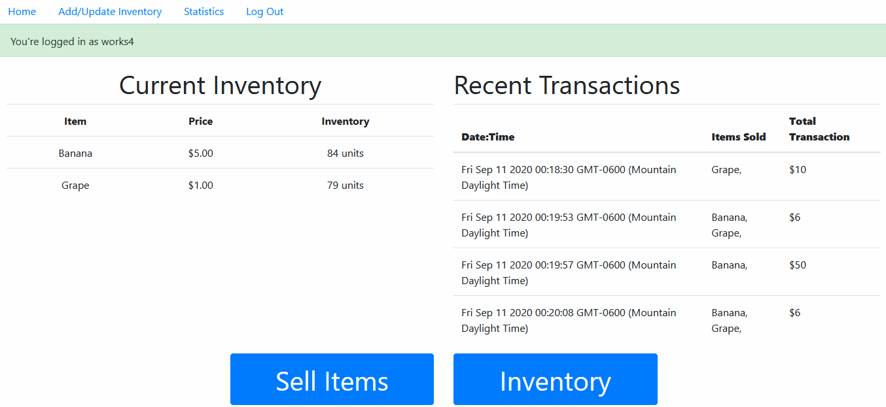
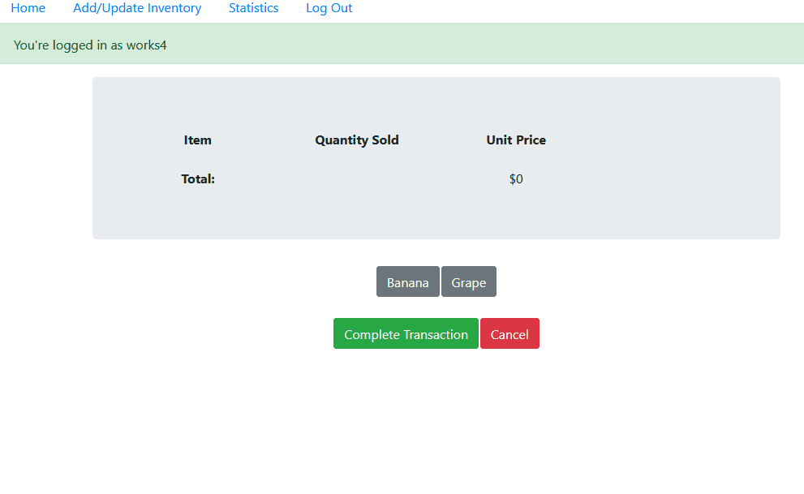
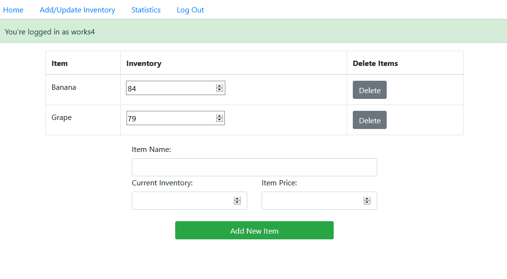
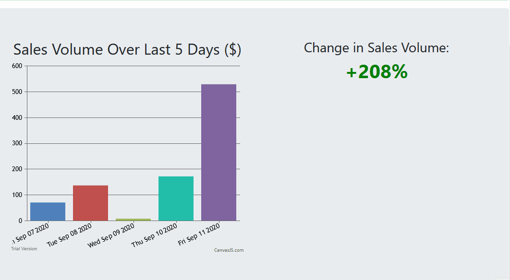

# EasySell

Ever work as a cashier? I did, during the Covid-19 pandemic I spent my days away from school at Walmart, working on and off the register, and nothing failed to infuritate me more than those damned IBM cash registers. Random errors, button issues, and not knowing the right combination of buttons to access something, all for a price restrictive to small, community-level non-profits. 

For my first, project, I decided to fix that. This is EasySell, it's a free, web-based point-of-sale system. 

*Features* 

* A RESTful API, built with Express and NodeJS, which is used to access user management, transaction, transaction logging and inventory management functions. 
* Inventory management using a MongoDB database, which stores products, inventory, and prices. 
* Transaction logging, storing items purchased, total transaction revenue, and transaction time, used for analytics.
* Performance analytics, delivering daily and weekly sales volume and percent change in sales volume. 
* User management to seperate transaction data and inventory by user. 
* Route security with Passport-JWT, preventing unauthorized access to transaction and inventory data.
* A responsive front-end designed with React, Bootstrap and ChartJS to perform transactions, manage inventory and view performance statistics. 

## Demo

If you want a quick look at my project, take a look at these gifts detailing the functions of my app! To play around with it, head over to the live link in the description and play around!

**A quick overview of the home screen and demo of the login and registration process:**

**Transaction Process, demonstrating validation and control:**

**Inventory Management Process:**

**Transaction Analytics demo, showing change after a transaction:**

## Deployment and Use

To deploy on your own machine, you will require a MongoDB Atlas Cluster, which you can create for free. Set environment variables PORT, MONGO_URI and PRIVATE_KEY for password hashing, and off you go! 

Looking to use this as it was intended, at a small business or non-profit fundraiser? Awesome, feel free to use the live version or Heroku, or deploy your own, and let me know! 

Thanks for having a read :)